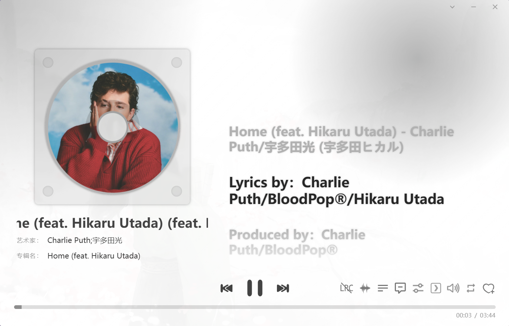

<h1 align="center">LX Music UR</h1>

  
  

<!-- [![GitHub release][1]][2]
[![Build status][3]][4]
[![GitHub Releases Download][5]][6]
[![dev branch][7]][8]
[![GitHub license][9]][10] -->

<!-- [1]: https://img.shields.io/github/release/lyswhut/lx-music-desktop
[2]: https://github.com/lyswhut/lx-music-desktop/releases
[3]: https://ci.appveyor.com/api/projects/status/flrsqd5ymp8fnte5?svg=true
[4]: https://ci.appveyor.com/project/lyswhut/lx-music-desktop
[5]: https://img.shields.io/github/downloads/lyswhut/lx-music-desktop/latest/total
[5]: https://img.shields.io/github/downloads/lyswhut/lx-music-desktop/total
[6]: https://github.com/lyswhut/lx-music-desktop/releases
[7]: https://img.shields.io/github/package-json/v/lyswhut/lx-music-desktop/dev
[8]: https://github.com/lyswhut/lx-music-desktop/tree/dev
[9]: https://img.shields.io/github/license/lyswhut/lx-music-desktop
[10]: https://github.com/lyswhut/lx-music-desktop/blob/master/LICENSE -->

基于 <code>lyswhut/lx-music-desktop</code> 修改的独立 UI 重构版本，当前主要聚焦播放详情页优化。

## 说明

本仓库不是原项目官方仓库，而是基于以下项目进行的个人修改版本：

- 原项目：<https://github.com/lyswhut/lx-music-desktop>

当前改动重点包括：

- 播放详情页靠拢<a href="https://github.com/any-listen/any-listen">any-listen</a>
- 播放详情页布局调整
- 左侧唱片/封面区域视觉重构
- 歌曲信息区长文本滚动展示优化
- 底部主控制区样式调整
- 歌词右键菜单与歌词显示细节优化

如需向原项目贡献代码，请以原项目仓库的说明、Issue 讨论及 `dev` 分支 PR 流程为准。
